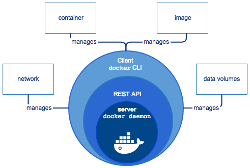
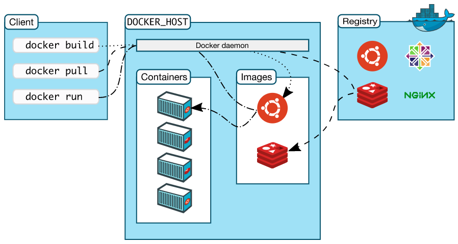

# Docker Overview

Docker is an open platform for developing, shipping, and running applications. Docker enables you to separate your applications from your infrastructures so you can deliver software quickly. With Docker, you can manage your infrastructure in the same ways you manage your applicaations. By taking advantage of Docker's methodologies for shipping, testing, and deploying code quickly, you can significantly reduce the delay between writing code and running it in production.

## The Docker Platform

Docker provides the ability to package and run an application in a loosely isolated environment called a `container`. The isolation and security allow you to run many containers simultaneously on a given host. Containers are lightweight because they don't need the extra load of a hypervisor, but run directly within the host machine's kernel. This means you can run more containers on a given hardware combination than if you were using virtual machines. You can even run Docker containers within host machines that are actually virtual machines!

Docker provides tooling and a platform to manage the lifecycle of your containers:

- Develop your application and its supporting components using containers

- The container becomes the unit for distributing and testing your application

- When you're ready, deploy your application into your production environment, as a container or an orchestrated service

## Docker Engine

*Docker Engine* is a client-server application with these major components:

- A server which is a type of long-running program called daemon process (`dockerd` command)

- A REST API which specifies interfaces that programs can use to talk to the daemon and instruct it what to do

- A command line interface(CLI) client (`docker` command)



The CLI uses the Docker REST API to control or interact with the Docker daemon through scripting or direct CLI commands. Many other Docker applications use the underlying API and CLI.

The daemon creates and manages Docker *objects*, such as images, containers, networks, and volumes.

## What can I use Docker for?

- Fast, consistent delivery of your applications

- Responsive deployment and scaling

- Running more workloads on the same hardware

## Docker Architecture

Docker uses a client-server architecture. The Docker *client* talks to the Docker *daemon*, which does the heavy lifting of building, running, and distributing your Docker containers. The Docker client and daemon *can* run on the same system, or you can connect a Docker client to a remote Docker daemon. The Docker client and daemon communicate using a REST API, over UNIX sockets or a network interface.



### Docker daemon

The Docker daemon(`dockerd`) listens for Docker API requests and manages Docker objects such as images, containers, networks, and volumes. A daemon can also communicate with other daemons to manage Docker services.

### Docker client

The Docker client(`docker`) is the primary way that many Docker users interact with Docker. When you use commands such as `docker run`, the client sends these commands to `dockerd`, which carries them out. The `docker` command uses the Docker API. The Docker client can communicate with more than one daemon.

### Docker registries

A Docker *registry* stores Docker images. Docker Hub is a public registry that anyone can use, and Docker is configured to look for images on Docker Hub by default. You can even run your own private registry. If you use Docker Datacenter(DDC), it includes Docker Trusted Registry(DTR)

When you use the `docker pull` or `docker run` commands, the required images are pulled from your configured registry. When you use the `docker push` command, your image is pushed to your configured registry.

### Docker objects

#### Images

An *image* is a read-only template with instructions for creating a Docker container. Often, an image is *based on* another image, with some additional customization. For example, you may build an image which is based on the `ubuntu` image, but installs the Apache web server and your application, as well as the configuration details needed to make your application run.

Selectively, you can choose to create your own image or images created by others. To build your own image, you create a *Dockerfile* with a simple syntax for defining the steps needed to create the image and run it. Each instruction in a Dockerfile creates a layer in the image. When a Dockerfile is modified, only those layers that have been changed are rebuilt.

#### Containers

A container is a runnable instance of an image. You can create, start, stop, move, or delete a container using the Docker API or CLI. You can connect a container to one or more networks, attach storage to it, or even create a new image based on its current state.

By default, a container is relatively well isolated from other containers and its host machine. You can control how isolated a container's network, storage, or other underlying subsystems are from other containers or from the host machine.

A container is defined by its image as well as any configuration options you provide to it when you create or start it. When a container is removed, any changes to its state that are not stored in persistent storage disappear.

##### Example `docker run` command

The following commands runs an `ubuntu` container, attaches interactively to your local command-line session, and runs `/bin/bash`

```bash
docker run -i -t ubuntu /bin/bash
```

When you run this command, the following happens:

1. If you do not have the `ubuntu` image locally, Docker pulls it from your configured registry, as though you had run `docker pull ubuntu` manually.

2. Docker creates a new container, as though you had run a `docker container create` command manually

3. Docker allocates a read-write filesystem to the container, as its final layer. This allows a running container to create or modify files and directories inits local filesystem.

4. Docker creates a network interface to connect the container to the default network, since you did not specify any networking options. This includes assigning an IP address to the container. By default, containers can connect to external networks using the host machine's network connection.

5. Docker starts the container and executes `/bin/bash`. Because the container is running interactively and attached to your terminal(due to the `-i` and `-t` flags), you can provide input using your keyboard while the output is logged to your terminal.

6. When you type `exit` to terminate `/bin/bash` command, the container stops but is not removed. You can start it again or remove it.

#### Services

Services allow you to scale container across multiple Docker daemons, which all work together as a *swarm* with multiple *managers* and *workers*. Each member of a swarm is a Docker daemon, and the daemons all communicate using the Docker API. A service allows you to define the desired state, such as the number of replicas of the service that must be available at any given time. By default, the service is load-balanced across all worker nodes. To the consumer, the Docker service appears to be a single application.