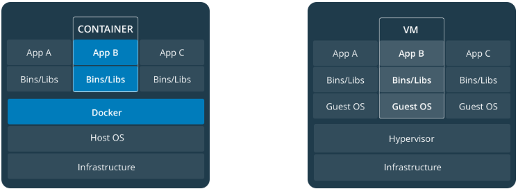

# Orientation and Setup

## Docker Concepts

Docker is a platform for developers and sysadmins to **build, share, and run** applications with containers. The use of containers to deploy applications is called *containerization*.

Containerization is increasingly popular because containers are:

- Flexible: Even the most complex applications can be containerized

- Lightweight

- Portable: You can build locally, deploy to the cloud, and run anywhere

- Loosely coupled: Containers are highly self-sufficient and encapsulated, allowing you to replace or upgrade one without disrupting others

- Scalable: You can increase and automatically distribute container replicas across a datacenter

- Secure

### Images and containers

Fundamentally, a `container` is nothing but a *running process*, with some added encapsulation features applied to it in order to keep it *isolated* from the host and from other containers. One of the most important aspects of container isolation is that each container interacts with its own, private filesystem; this filesystem is provided by a Docker **image**. An image includes everything needed to run an application(i.e. code, dependencies, etc)

### Containers and virtual machines

A container runs *natively* on Linux and shares the kernel of the host machine with other containers. It runs a discrete process, taking no more memory than any other executable, making it *lightweight*.

By contrast, a **virtual machine**(VM) runs a full-blown "guest" operating system with *virtual* access to host resources through a hypervisor.



### Orchestration

The portability and reproducibility of a containerized process mean we have an opportunity to move and scale our containerized applications across clouds and datacenters.

Tools to manage, scale, and maintain containerized applications are called *orchestrators*, and the most common examples of these are *Kubernetes* and *Docker Swarm*.

## Install Docker Desktop

- [OSX](https://docs.docker.com/docker-for-mac/install/)

- [Windows](https://docs.docker.com/docker-for-windows/install/)

## Enable Docker Swarm

1. Open a terminal and initialize Docker Swarm mode:

```bash
docker swarm init

# expected output
Swarm initialized: current node (tjjggogqpnpj2phbfbz8jd5oq) is now a manager.

To add a worker to this swarm, run the following command:

    docker swarm join --token SWMTKN-1-3e0hh0jd5t4yjg209f4g5qpowbsczfahv2dea9a1ay2l8787cf-2h4ly330d0j917ocvzw30j5x9 192.168.65.3:2377

To add a manager to this swarm, run 'docker swarm join-token manager' and follow the instructions.
```

2. Run a simple Docker service that uses an alpine-based filesystem, and isolates a ping to 8.8.8.8:

```bash
docker service create --name demo alpine:3.5 ping 8.8.8.8
```

3. Check that your service created one running container:

```bash
docker service ps demo

# expected output
ID                  NAME                IMAGE               NODE                DESIRED STATE       CURRENT STATE           ERROR               PORTS
463j2s3y4b5o        demo.1              alpine:3.5          docker-desktop      Running             Running 8 seconds ago
```

4. Check that you get the logs you'd expect for a ping process:

```bash
docker service logs demo

# expected output
demo.1.463j2s3y4b5o@docker-desktop    | PING 8.8.8.8 (8.8.8.8): 56 data bytes
demo.1.463j2s3y4b5o@docker-desktop    | 64 bytes from 8.8.8.8: seq=0 ttl=37 time=13.005 ms
demo.1.463j2s3y4b5o@docker-desktop    | 64 bytes from 8.8.8.8: seq=1 ttl=37 time=13.847 ms
demo.1.463j2s3y4b5o@docker-desktop    | 64 bytes from 8.8.8.8: seq=2 ttl=37 time=41.296 ms
...
```

5. Finally, tear down your test service:

```bash
docker service rm demo
```